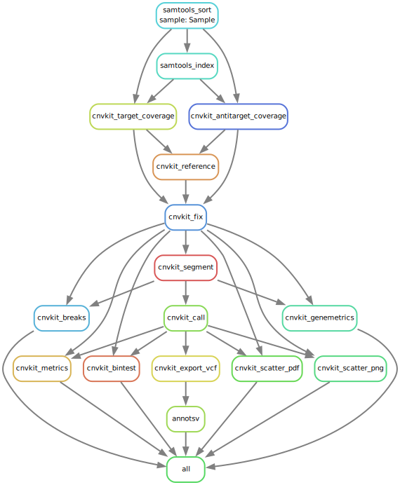

# CNVand
[](https://snakemake.bitbucket.io)
[](https://anaconda.org/conda-forge/mamba)


[](code_of_conduct.md) 

CNVand is a snakemake workflow for CNV analysis, tailored for preparing data used by the [CNVizard](https://github.com/IHGGM-Aachen/CNVizard) CNV visualization tool. Given a set of BAM and VCF files, it utilizes the tools `CNVkit` and `AnnotSV` to analyze and annotate copy number variations.

<div align="center">
  
</div>

## General Settings and Samplesheet
To configure this pipeline, modify the config under `config/config.yaml` as needed. Detailed explanations for each setting are provided within the file.

Add samples to the pipeline by completing `config/samplesheet.tsv`. Each `sample` should be associated with a `path` to the corresponding BAM and VCF file.

For detailed instructions on how to configure CNVand see `config/README.md`.

## Reference Files
To use CNVand some external reference files are needed alongside your sample data.

### Genome

For `cnvkit_fix` to work, you need to specify a reference genome in the config file. Take care to use the same reference file for your entire workflow!

### Annotations

For AnnotSV to work, the annotation files must be downloaded separately and be referenced in the config file under the respective key. For human annotations, this can be done [here](https://www.lbgi.fr/~geoffroy/Annotations/Annotations_Human_3.4.2.tar.gz). In case this link is not working, check the original [AnnotSV](https://github.com/lgmgeo/AnnotSV/tree/master) repository for updates on how to obtain the annotations.

## Pipeline Setup
CNVand can be executed using mamba environments or a pre-built docker container.

### Mamba (Snakedeploy)
For a one-click installation, snakedeploy can be used. For further information, see the entry for CNVand in the [Snakemake Workflow Catalog](https://snakemake.github.io/snakemake-workflow-catalog/?repo=IHGGM-Aachen/CNVand)

### Mamba (Manual)
This workflow can easily setup manually with the given environment file. Install Snakemake and dependencies using the command:

```bash
mamba env create -f environment.yml
```

Then activate the newly created environment with: 

```bash
mamba activate cnvand
```

Now configure the pipeline and download the needed annotation and refenrece files. When everything is set up, Execute the pipeline with:

```bash
snakemake --cores all --use-conda
```

Generate a comprehensive execution report by running:

```bash
snakemake --report report.zip
```


### Docker

CNVand can also be used inside a Docker container. To do so, first pull the Docker image with:

```bash
docker pull ghcr.io/ihggm-aachen/cnvand:latest
```

Then run the container with the bind mounts needed in your setup:

```bash
docker run -it -v /path/to/your/data:/data ghcr.io/ihggm-aachen/cnvand:latest /bin/bash
```

This command opens an interactive shell inside the Docker container. Once inside the container, you are placed inside the `/cnvand` the directory. From there then run the pipeline once you set an appropriate configuration:

```bash
snakemake --cores all --use-conda
```

## Contributing

We welcome contributions to improve CNVand. Please see our [CONTRIBUTING.md](CONTRIBUTING.md) for details on how to get started.

## Code of Conduct

We are committed to fostering an open and welcoming environment. Please see our [CODE_OF_CONDUCT.md](CODE_OF_CONDUCT.md) for our community guidelines.

## Documentation

Detailed documentation for the workflow can be found in `workflow/documentation.md`.

## Testing

To ensure the pipeline runs correctly, we have set up both unit and integration tests. Unit tests are generated from successful workflow runs, and integration tests are configured to run the entire workflow with test data.

### Integration Tests

The integration test can be run using the data and config provided. Remember to download the correct reference/annotations (GRCh38 in case of the bundled NIST data) by yourself and adjust your local paths as necessary!

### Unit Tests

Run the unit tests with:

```bash
pytest -v .tests/unit
```

This will check for the correct CNVand output per rule.

## License

This project is licensed under the MIT License. See the [LICENSE](LICENSE.md) file for details.
